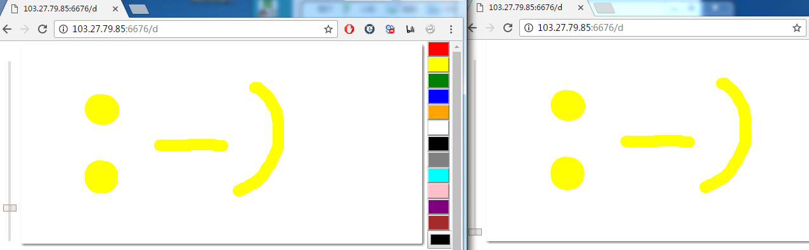

# Goal
The goal of this project is to provide an online real-time cross-platform multi-player Draw Something game based on low latency
web socket, with some additional function (conversion between simplified Chinese and traditional Chinese so
people spoke these two similar language can play together)

# Client support  
Any browser that support Html5 and websocket, including android and iOS

# Current progress
- [x] Drawing canvas
- [x] Synchronize canvas among multiple users
- [x] Online chat (chat box is at the bottom)
- [ ] A good layout Design for both PC and smart device
- [ ] Game workflow control
It has been suspended for a long time due to... my poor knowledge about html layout handling. Adjusting css
to support both PC and smart phone kill a lot of my time  

# Screenshot  
  

# Starting service
Basically, `python app.py` will start the service, but without websocket feature (it will use long-poll instead) 
You can enable websocket with gunicorn:  
`gunicorn --worker-class eventlet -w 1 -b 0.0.0.0:6676 app:app`  
See also [flask-socketIO](https://flask-socketio.readthedocs.io/en/latest/) for more detail
